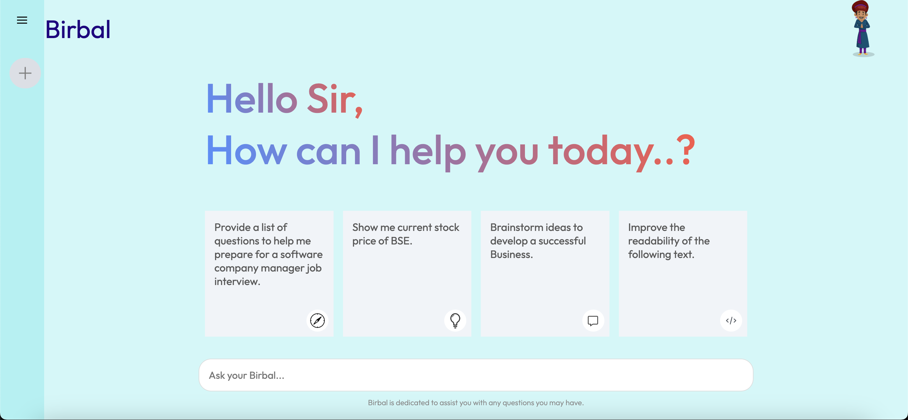

# 🫧 Birbal Chatbot

The **Gemini** app is a cutting-edge AI application powered by Google's Gemini API, offering users the ability to interact with generative AI models seamlessly. It enables users to leverage multimodal capabilities, including text and image inputs, to generate responses and perform various AI-related tasks.

## 🚀Features

- Chat Interface: Provides a dedicated interface for interacting with the Gemini model in a conversational style.
- Simulated Typing Effect: Enhances the user experience by mimicking a natural typing effect during responses.
- Google Gemini Integration: Utilizes the capabilities of the Google Gemini model for generating informative responses.

## ⚡Technologies

- React.js: Frontend framework for building dynamic user interfaces.
- Gemini API: Backend API provided by Gemini for accessing exchange functionalities.
- CSS: styling languages for designing the user interface.

## Contact 📧
For any queries or feedback, please contact:

**Aman Pathak**

